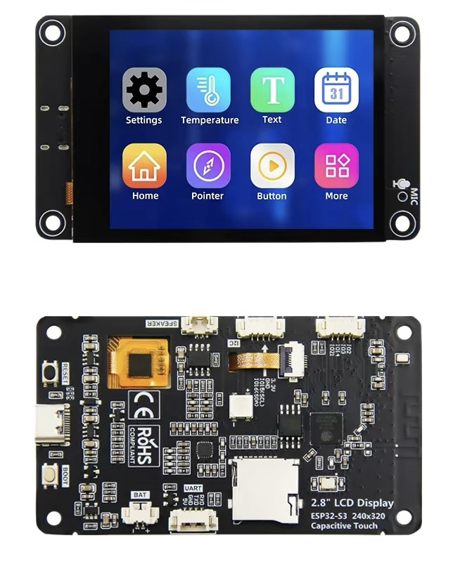

# Tesla BLE TFT Dashboard / 特斯拉 BLE TFT 仪表盘

<sub>ESP32-S3 · LVGL 8 · Tesla BLE Protocol | [English](#english) | [中文](#中文)</sub>

---

<a name="english"></a>
## English

ESP32-S3 Tesla digital dashboard. Connects to Model 3/Y via BLE, renders real-time telemetry on a 320x240 TFT.



### For Users — No Coding Required

**Step 1: Flash**
1. Download `tesla_ble_dash_vX.X.bin` from [Releases](https://github.com/elementchen/TESLA_BLE_TFT/releases)
2. Download [Espressif Flash Tool](https://www.espressif.com/en/support/download/other-tools)
3. Select chip `ESP32-S3`, load the single `.bin` file at address **`0x0000`**

4. SPI: **80MHz, QIO, 16MB**. Click START.


**Step 2: Configure**
1. Download the config tool from Releases (`ESP32_Config_Tool_macOS.zip` or `.exe`)
2. Connect ESP32 via USB, pick your display preset, enter your 17-char Tesla VIN
3. Click **Save & Reboot**

**Step 3: Pair**
Display shows "TAP CARD" → tap your Tesla keycard on the center console. Done. Auto-reconnects every startup.

### For Developers

```bash
git clone https://github.com/elementchen/TESLA_BLE_TFT.git
cd TESLA_BLE_TFT
idf.py set-target esp32s3 && idf.py build && idf.py -p /dev/cu.usbmodem* flash
```
Then configure VIN: `pip install pyserial && python3 mac_flash_app/esp32_config.py set-vin YOUR_VIN save reboot`

### Credits · [yoziru/tesla-ble](https://github.com/yoziru/tesla-ble) · LVGL · SquareLine Studio · ESP-IDF · MIT

---

<a name="中文"></a>
## 中文

基于 ESP32-S3 的开源特斯拉仪表盘，通过 BLE 连接 Model 3/Y，在 320x240 TFT 上显示实时遥测。

### 普通用户 — 无需编程

**第一步：烧录**
1. 从 [Releases](https://github.com/elementchen/TESLA_BLE_TFT/releases) 下载 `tesla_ble_dash_vX.X.bin`
2. 下载 [乐鑫烧录工具](https://www.espressif.com/zh-hans/support/download/other-tools)
3. 芯片选 `ESP32-S3`，加载 `.bin` 文件到地址 **`0x0000`**


4. SPI 设置：**80MHz, QIO, 16MB**。点 START。


**第二步：配置**
1. 从 Releases 下载配置工具（`ESP32_Config_Tool_macOS.zip` 或 `.exe`）
2. ESP32 用 USB 连接电脑，选择显示屏预设，填入 17 位 VIN
3. 点击 **Save & Reboot**

**第三步：配对**
屏幕显示 "TAP CARD" → 把特斯拉钥匙卡放在中控台感应区。完成。以后每次开机自动连接。

### 开发者

```bash
git clone https://github.com/elementchen/TESLA_BLE_TFT.git
cd TESLA_BLE_TFT
idf.py set-target esp32s3 && idf.py build && idf.py -p /dev/cu.usbmodem* flash
```
然后用配置工具写入 VIN：`pip install pyserial && python3 mac_flash_app/esp32_config.py set-vin 你的VIN save reboot`

### 致谢 · [yoziru/tesla-ble](https://github.com/yoziru/tesla-ble) · LVGL · SquareLine Studio · ESP-IDF · MIT
